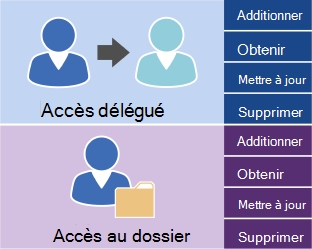

# Gestion de l’accès utilisateur à l’aide de EWS dans ExchangeManaging user access by using EWS in Exchange

Découvrez quelles sont vos options pour la gestion de compte d’utilisateur accès à votre serveur Exchange.Find out what your options are for managing user account access to your Exchange server.
  
API gérée d’Exchange Web Services (EWS) et le EWS fournissent un nombre limité d’opérations que vous pouvez utiliser pour gérer les comptes dans Exchange Online, Exchange Online dans le cadre d’Office 365 ou une version d’Exchange commençant par Exchange 2013.Exchange Web Services (EWS) and the EWS managed API provide a limited number of operations that you can use to manage accounts on Exchange Online, Exchange Online as part of Office 365, or a version of Exchange starting with Exchange 2013. Vous pouvez utiliser les opérations indiquées dans la figure suivante pour gérer les délégués et pour définir des autorisations d’accès au dossier pour les autres comptes.You can use the operations shown in the following figure to manage delegates and to set folder access permissions for other accounts. 
  
**Opérations EWS pour l’accès délégué et de dossier****EWS operations for delegate and folder access**

  
Si votre application a besoin d’un contrôle supplémentaire sur les comptes sur un serveur Exchange, vous pouvez utiliser les applets de commande Exchange Management Shell pour gérer les comptes.If your application needs additional control over the accounts on an Exchange server, you can use Exchange Management Shell cmdlets to manage the accounts. Vous pouvez appeler les applets de commande Exchange Management Shell en effectuant l’une des options suivantes :You can call the Exchange Management Shell cmdlets by doing one of the following:
  
- Écriture d’une application à l’aide de c# ou Visual Basic qui appelle les applets de commande Exchange Management Shell.Writing an application using C# or Visual Basic that calls the Exchange Management Shell cmdlets. Vous pouvez consulter l’exemple de code dans la [documentation sur Exchange Management Shell API](../management/exchange-management-shell.md) pour découvrir comment appeler une applet de commande.You can look at the sample code in the [Exchange Management Shell API documentation](../management/exchange-management-shell.md) to learn how to call a cmdlet. 
    
- À l’aide de Windows PowerShell et les scripts Windows PowerShell pour appeler les applets de commande Exchange Management Shell.Using Windows PowerShell and Windows PowerShell scripts to call Exchange Management Shell cmdlets. Vous trouverez une liste complète de la [Exchange Server PowerShell (Exchange Management Shell)](https://docs.microsoft.com/en-us/powershell/exchange/exchange-server/exchange-management-shell?view=exchange-ps), ainsi que des exemples qui montrent comment les utiliser.You can find a complete list of the [Exchange Server PowerShell (Exchange Management Shell)](https://docs.microsoft.com/en-us/powershell/exchange/exchange-server/exchange-management-shell?view=exchange-ps), along with examples that show how to use them. 
    
## Voir aussiSee also

- [La configuration de vos applications EWSSetting up your EWS application](setting-up-your-ews-application.md)   
- [Applets de commande Exchange 2013Exchange 2013 Cmdlets](https://docs.microsoft.com/en-us/powershell/exchange/?view=exchange-ps)  
    

